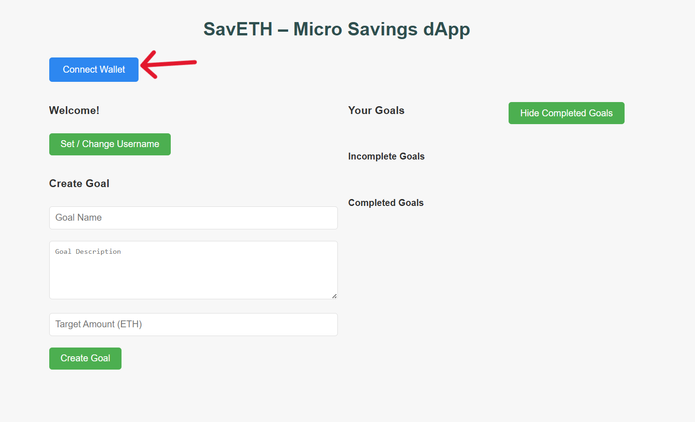
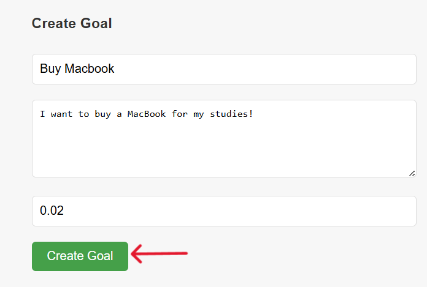
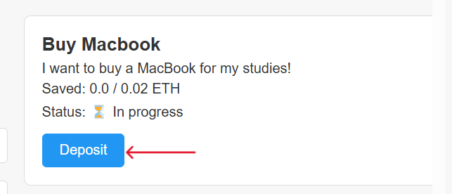
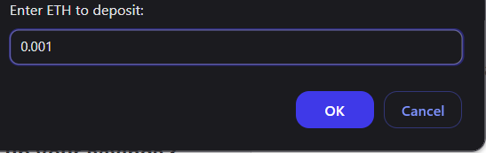
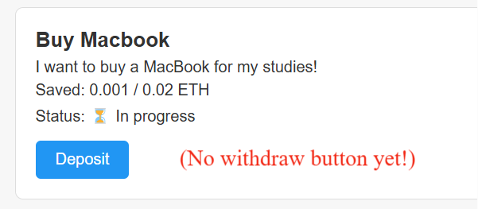
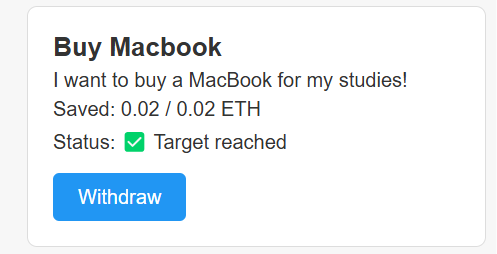
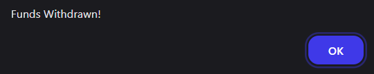

<p align="center">
  
</p>

# SavETH – Goal-Based Micro-Savings dApp

*(I built this dApp as a project submission for Byteverse 7.0 Hackathon (2025), organized by NIT Patna.)*

A decentralized savings vault where users define savings goals (like saving for a laptop or a vacation), deposit small amounts of ETH over time, and withdraw only once the goal is fully funded.

**Track:** Web3 – Blockchain  
**Theme:** Finance  

[🌐 Deployed link (Netlify)](https://saveth.netlify.app/)

[🔗 Etherscan link (Optimism Sepolia)](https://sepolia-optimism.etherscan.io/address/0xD5e86470A713624138c2FdC77d376AAFf9383d02)  
Deployed Contract Address: `0xD5e86470A713624138c2FdC77d376AAFf9383d02`

[📃 Presentation Slides (Google Drive link)](https://docs.google.com/presentation/d/1mg00J5aPAmSwO-Z8WbiASxjcbDtX0xV_oZ6qXIRl5f8/edit?usp=sharing)

[📽️ Demonstration Video link](https://drive.google.com/file/d/1XwKEjvey0fqzflMNOgss1LNxl5Xo0cmq/view?usp=sharing)

---

## 📘 Overview

### ❗ Problem Statement

Existing micro-savings options are either centralized, lack transparency, or don’t support goal-based locking of funds. There's no easy way to save toward specific goals in a decentralized, non-custodial way.

### 🎯 Purpose

SavETH solves this by providing a decentralized savings vault where users can:

- Define custom savings goals (with names, descriptions, and target amounts)
- Deposit small amounts of ETH toward each goal
- Lock funds until the goal is reached
- Withdraw funds only once the goal is fulfilled, preventing impulsive spending

### 🚀 Objectives

- Empower users to build better saving habits using smart contracts
- Ensure funds remain non-custodial, verifiable, and trustless
- Keep the dApp simple, gas-efficient, and easy to use for real users

---

## 💻 Features

- Multiple concurrent savings goals per user
- Withdrawals only allowed after reaching targets
- Optional username feature
- Frontend integration-ready
- Fully tested smart contracts using Foundry

---

## ⚙️ How It Works:

1. User connects their wallet with the dApp.
<p align="center">
  
</p>

2. User creates a savings goal with a target amount of funds to save (e.g., "Buy MacBook – 0.02 ETH").
<p align="center">
  
</p>

3. User deposits funds into that goal whenever they want.
<p align="center">
  
</p>
<p align="center">
  
</p>

4. Funds are **locked** until the goal is fully funded. This means the user cannot withdraw their funds until they have reached their target.
<p align="center">
  
</p>

5. Once the target is reached, user can withdraw.
<p align="center">
  
</p>
<p align="center">
  
</p>

6. A user can create as many savings goals as they want at a time.

---

## 📊 Example (On-chain Storage):

```javascript
SavingsVault Contract  
├── User 1  
│   ├── Goal 0: "Laptop" – 0.8 / 2.5 ETH saved  
│   └── Goal 1: "Bag" – 0.0001 / 0.005 ETH saved  
├── User 2  
│   ├── Goal 0: "Car" – 5 / 15 ETH saved  
│   └── Goal 1: "Microwave" – 0.5 / 0.5 ETH saved ✅ (Withdrawable)
```

---

## 📎 Dependencies

### User requirements
- A Web3 wallet (e.g, [MetaMask](https://chromewebstore.google.com/detail/metamask/nkbihfbeogaeaoehlefnkodbefgpgknn))
- Basic Web3/Blockchain knowledge (e.g, gas, private key safety, etc.)

### Developer setup (for local testing/development)
- Solidity ^0.8.24
- [Foundry](https://github.com/foundry-rs/foundry)
- [ethers.js](https://docs.ethers.org/v6/)
- Node.js (for frontend, if customizing or developing further)
- Testnet ETH ([Ethereum Sepolia testnet faucet](https://cloud.google.com/application/web3/faucet/ethereum/sepolia))

---

## 📈 Future Scope

- INR / Fiat Integration: Use price feed oracles to display the INR equivalent of each goal and deposit, making the app more intuitive for Indian users.
- Social Goal Sharing: Allow users to share public goal pages (read-only) with usernames, enabling a social savings culture or public accountability.
- Recurring Deposits: Integrate optional reminders or automation for monthly contributions.
- Group Goals: Enable collaborative goals where multiple people deposit toward a shared target.

---