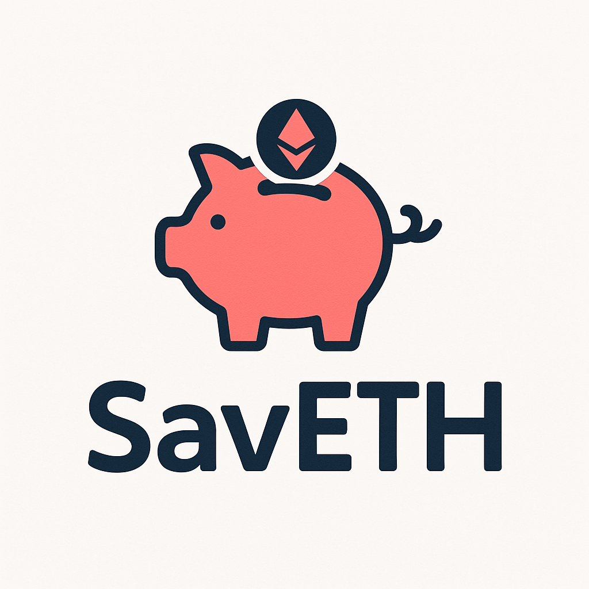

<p align="center">
  
</p>

# SavETH – Goal-Based Micro-Savings dApp

A decentralized savings vault where users define savings goals (like saving for a laptop or a vacation), deposit small amounts of ETH over time, and withdraw only once the goal is fully funded.

**Track:** Web3 – Blockchain  
**Theme:** Finance  

[🔗 Etherscan link (Optimism Sepolia)](https://sepolia-optimism.etherscan.io/address/0xD5e86470A713624138c2FdC77d376AAFf9383d02)  
Deployed Contract Address: `0xD5e86470A713624138c2FdC77d376AAFf9383d02`
 
🧾 [Presentation Slides (Google Drive link)](https://www.google.com) 

---

## 📼 Demonstration video

Here’s a short demo showcasing the key features of SavETH in action:

<video src="./demo.mp4" width="80%" controls>
  Your browser does not support the video tag.
</video>

---

## 💻 Features

- Multiple concurrent savings goals per user
- Withdrawals only allowed after reaching targets
- Optional username feature
- Frontend integration-ready
- Fully tested smart contracts using Foundry

---

## ⚙️ How It Works:

1. 🎯 User creates a savings goal (e.g., "Buy MacBook – 2 ETH").
2. 💸 User deposits funds into that goal whenever they want.
3. 🔒 Funds are **locked** until the goal is fully funded.
4. 🔑 Once the target is reached, user can withdraw.

---

## 📊 Example (On-chain Storage):

```javascript
SavingsVault Contract  
├── User 1  
│   ├── Goal 0: "Laptop" – 0.8 / 2.5 ETH saved  
│   └── Goal 1: "Bag" – 0.0001 / 0.005 ETH saved  
├── User 2  
│   ├── Goal 0: "Car" – 5 / 15 ETH saved  
│   └── Goal 1: "Microwave" – 0.5 / 0.5 ETH saved ✅ (Withdrawable)
```

---

## 📎 Dependencies
- Solidity ^0.8.24
- [Foundry](https://github.com/foundry-rs/foundry)

---

Frontend coming soon...